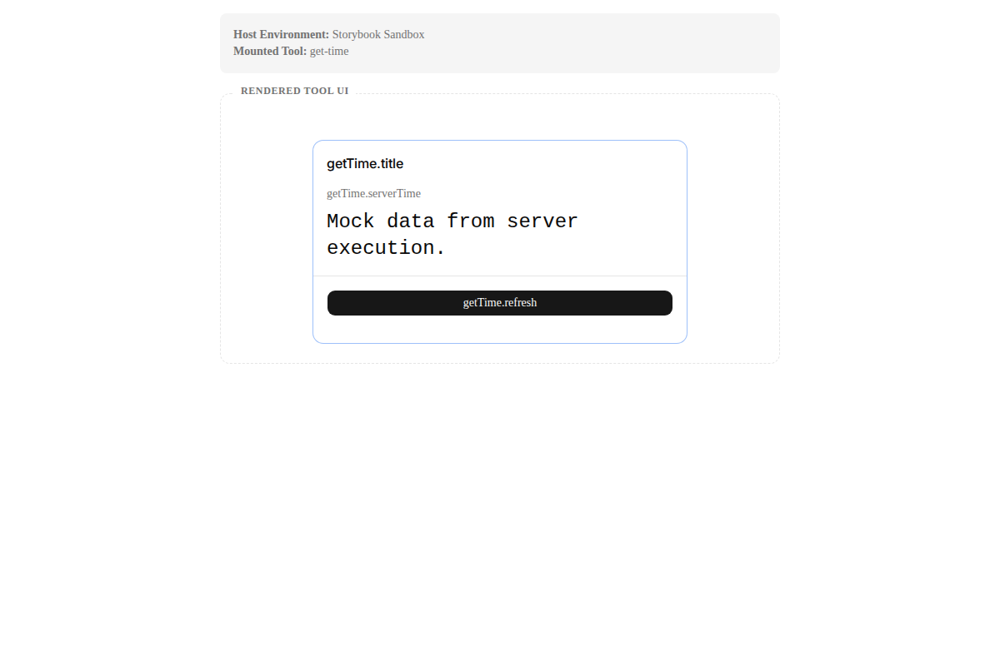
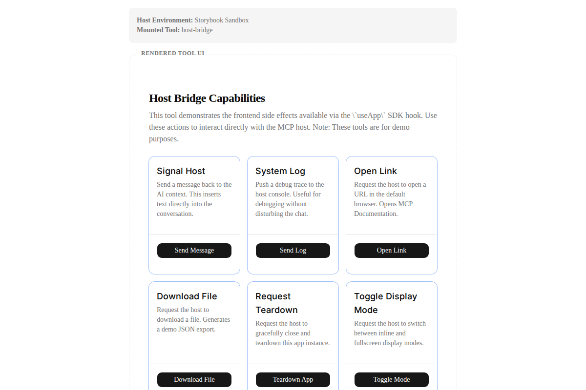
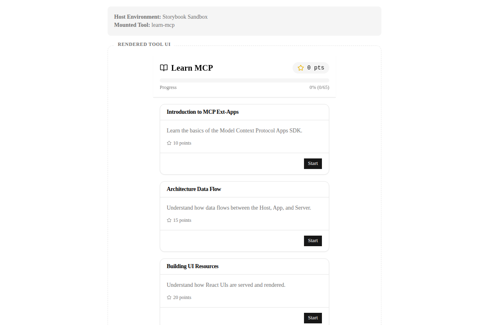
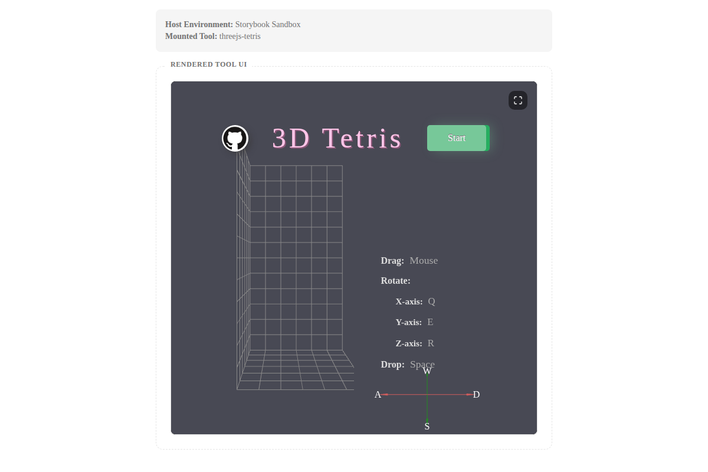
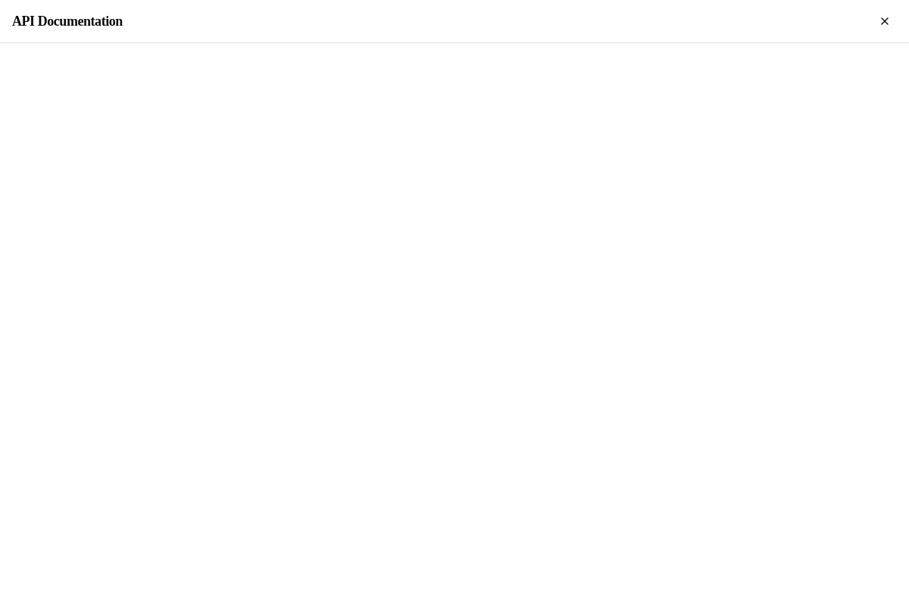

# MCP React App

A comprehensive full-stack starter template and didactic reference for building rich Interactive Tool UIs using the Model Context Protocol (MCP) and React.

This application acts as a sandbox that demonstrates how to implement a complex, multi-tool extension utilizing Vite, Tailwind CSS, Base UI, and the `@modelcontextprotocol/ext-apps/react` SDK.

## 🛠️ Included Tools

This repository showcases 6 fully-functional MCP tools, each highlighting different capabilities of the Ext-Apps SDK.

### File Explorer
A tool to navigate and interact with the sandboxed file system.


### Get Time
A robust example of server-side data fetching and dynamic UI updates via the Host Bridge.



### Host Bridge
Demonstrates two-way messaging, logging, and interaction with the parent Host Context.



### Learn MCP
A step-by-step interactive wizard designed to introduce the core concepts of the Model Context Protocol.



### ThreeJS Tetris
A complex, WebGL-powered 3D Tetris implementation proving that high-performance graphical apps can be embedded seamlessly as MCP Tool UIs.



### View Docs
A documentation viewer tool that renders dynamically generated TypeDoc API documentation securely via an iframe.




## 🚀 Getting Started

```bash
bun install
bun run dev
```

### Local Storybook Sandbox

Because MCP Tool UIs expect to be injected into a Host Context, running `bun run dev` will simply show a waiting screen. To actively develop and test the UIs locally, use the provided Storybook sandbox environment:

```bash
bun run storybook
```

This launches a complete Host simulator with real-time editing.

## 🏗️ Architectural Overview

- **Micro-Manifest Architecture:** Each tool is fully self-contained within `src/tools/<name>` and exports a `ToolManifest` which is aggregated by a central registry (`src/tools/registry.ts`).
- **Single File Build:** The UI is bundled into a standalone `mcp-app.html` using `vite-plugin-singlefile`, allowing seamless transport via serverless environments.
- **Dynamic Context Injection:** The main React App (`src/mcp-app.tsx`) acts purely as a router, extracting the `toolName` string from `hostContext.toolInfo.tool.name` and rendering the corresponding registered component.

## 🌗 Theming & Typography

The application automatically synchronizes its visual theme with the Host environment. The core `McpProvider` hook monitors the `hostContext.theme` property and injects Tailwind's `.dark` class directly into the document root.

Typography relies on the Inter font (`@fontsource-variable/inter`) properly configured via Tailwind configuration and CSS variables.

## 📦 Build System

The project uses `bun` for fast, reproducible builds and supports two modes:

- **`bun run build:ui`**: Compiles the React UI into the static `mcp-app.html` artifact.
- **`bun run build:full`**: Compiles the UI, and then builds the underlying Node.js MCP server responsible for bridging the Host commands.
