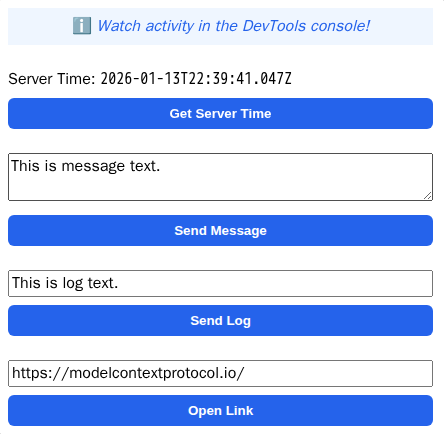

# Example: Basic Server (React)



An MCP App example with a React UI.

> [!TIP]
> Looking for a vanilla JavaScript example? See [`basic-server-vanillajs`](https://github.com/modelcontextprotocol/ext-apps/tree/main/examples/basic-server-vanillajs)!

## MCP Client Configuration

Add to your MCP client configuration (stdio transport):

```json
{
  "mcpServers": {
    "basic-react": {
      "command": "npx",
      "args": [
        "-y",
        "--silent",
        "--registry=https://registry.npmjs.org/",
        "@modelcontextprotocol/server-basic-react",
        "--stdio"
      ]
    }
  }
}
```

### Local Development

To test local modifications, use this configuration (replace `~/code/ext-apps` with your clone path):

```json
{
  "mcpServers": {
    "basic-react": {
      "command": "bash",
      "args": [
        "-c",
        "cd ~/code/ext-apps/examples/basic-server-react && npm run build >&2 && node dist/index.js --stdio"
      ]
    }
  }
}
```

## Overview

- Tool registration with a linked UI resource
- React UI using the [`useApp()`](https://apps.extensions.modelcontextprotocol.io/api/functions/_modelcontextprotocol_ext-apps_react.useApp.html) hook
- App communication APIs: [`callServerTool`](https://apps.extensions.modelcontextprotocol.io/api/classes/app.App.html#callservertool), [`sendMessage`](https://apps.extensions.modelcontextprotocol.io/api/classes/app.App.html#sendmessage), [`sendLog`](https://apps.extensions.modelcontextprotocol.io/api/classes/app.App.html#sendlog), [`openLink`](https://apps.extensions.modelcontextprotocol.io/api/classes/app.App.html#openlink)

## Key Files

- [`server.ts`](server.ts) - MCP server with tool and resource registration
- [`mcp-app.html`](mcp-app.html) / [`src/mcp-app.tsx`](src/mcp-app.tsx) - React UI using `useApp()` hook

## Getting Started

```bash
npm install
npm run dev
```

## How It Works

1. The server registers a `get-time` tool with metadata linking it to a UI HTML resource (`ui://get-time/mcp-app.html`).
2. When the tool is invoked, the Host renders the UI from the resource.
3. The UI uses the MCP App SDK API to communicate with the host and call server tools.

## Build System

The project supports two primary build flavors:

- **`npm run build:ui` (Static UI Only):** Bundles the entire React application into a single, self-contained HTML file (`mcp-app.html`) using Vite with `vite-plugin-singlefile`. This allows all UI content (JS, CSS) to be fully inlined. Because it is a standalone static file, you can host `mcp-app.html` anywhere (e.g., AWS S3, GitHub Pages, Netlify, or any CDN). Note: When hosted separately, it still requires connection to a backend MCP server to function as a complete tool.
- **`npm run build:full` (Full Stack):** Compiles both the static UI (`build:ui`) and the backend MCP server (`server.ts`, `main.ts`) into a Node.js-compatible distribution (`dist/`). This is the default build step for production deployments where you want to host both the UI and the MCP SSE endpoints together.

Alternatively, MCP apps can load external resources by defining [`_meta.ui.csp.resourceDomains`](https://apps.extensions.modelcontextprotocol.io/api/interfaces/app.McpUiResourceCsp.html#resourcedomains) in the UI resource metadata.

## Deployment Notes

### Long-Running Environments (Recommended)
For production deployments, we strongly recommend deploying this template (using `build:full`) to a traditional, long-running Node.js environment. Examples include:
- **Render** (Web Services)
- **Railway**
- **Heroku**
- **DigitalOcean App Platform** or a VPS

### Serverless Environments (Vercel, Netlify, AWS Lambda)
**This application IS compatible with stateless Serverless Functions (e.g., Vercel).**

This MCP server has been successfully tested and is currently running in production on Vercel. While Serverless environments do implement strict execution timeouts and destroy memory state between function invocations, Vercel's Node.js runtime and standard API configurations handle the Server-Sent Events (SSE) connections used by MCP well enough for typical stateless tool executions and standard interactions to succeed.
